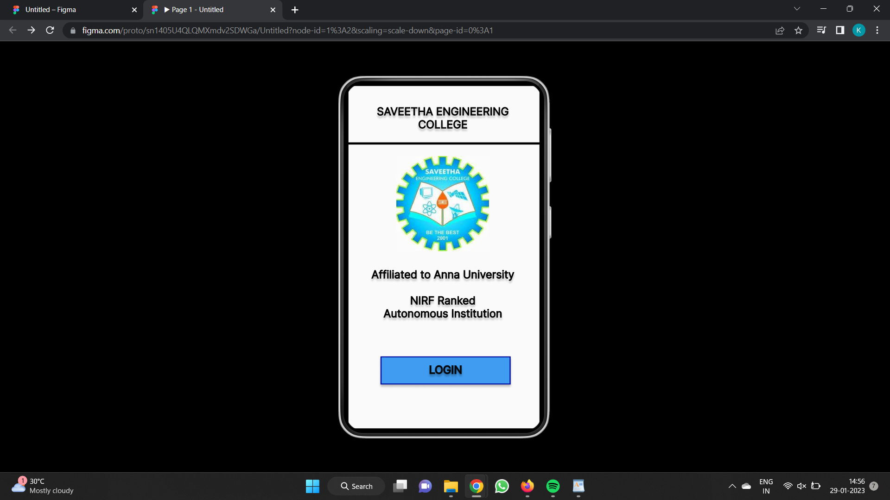
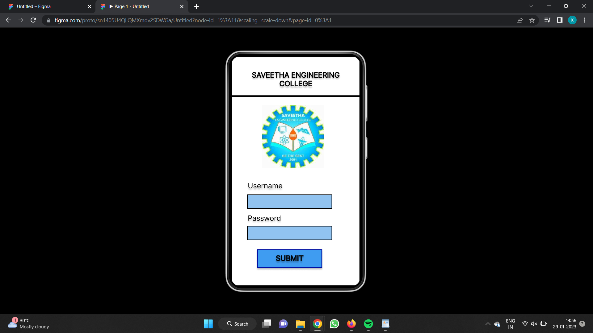
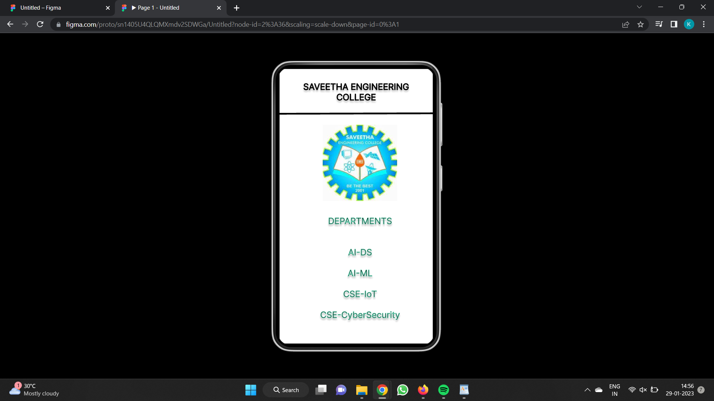

# Event Registration Web Application

## AIM:
To design, develop and deploy a web application for event registration.

## DESIGN STEPS:

### Step 1:
Create a new frame.

### Step 2:
Select any one preset size of your choice.

### Step 3:
Select the shapes you need.

### Step 4:
Import images as needed.

### Step 5:
Create pages based on your need and link them.

### Step 6:

Validate the HTML and CSS code.

### Step 6:

Publish the website in the given URL.

## DESIGN TOOL:
Figma

## CODE:
```
/* Home Page */


box-sizing: border-box;

position: relative;
width: 360px;
height: 640px;

background: #FAFAFA;
border: 4px solid #000000;
/* SAVEETHA ENGINEERING COLLEGE */


position: absolute;
width: 320px;
height: 52px;
left: 18px;
top: 39px;

font-family: 'Inter';
font-style: normal;
font-weight: 400;
font-size: 20px;
line-height: 24px;
text-align: center;

color: #000000;

border: 1px solid #000000;
text-shadow: 0px 4px 4px rgba(0, 0, 0, 0.25);


/* Affiliated to Anna University NIRF Ranked Autonomous Institution */


position: absolute;
width: 320px;
height: 146px;
left: 18px;
top: 340px;

font-family: 'Inter';
font-style: normal;
font-weight: 400;
font-size: 20px;
line-height: 24px;
text-align: center;

color: #000000;

border: 1px solid #000000;
text-shadow: 0px 4px 4px rgba(0, 0, 0, 0.25);


/* Line 1 */


position: absolute;
width: 360px;
height: 0px;
left: 0px;
top: 112px;

border: 4px solid #000000;


/* logo 1 */


position: absolute;
width: 171px;
height: 176px;
left: 92px;
top: 133px;

background: url(logo.jpg);


/* Rectangle 1 */


position: absolute;
width: 236px;
height: 48px;
left: 65px;
top: 505px;

background: #3F9CF1;
border: 2px solid #0010A2;
box-shadow: 0px 4px 4px rgba(0, 0, 0, 0.25);


/* LOGIN */


position: absolute;
width: 176px;
height: 25px;
left: 95px;
top: 516px;

font-family: 'Inter';
font-style: normal;
font-weight: 400;
font-size: 20px;
line-height: 24px;
/* identical to box height */

text-align: center;

color: #000000;

border: 2px solid rgba(0, 0, 0, 0.75);
text-shadow: 0px 4px 4px rgba(0, 0, 0, 0.25);

/* Login Page */


box-sizing: border-box;

position: relative;
width: 360px;
height: 640px;

background: #FFFFFF;
border: 4px solid #000000;

/* Line 2 */


position: absolute;
width: 359.49px;
height: 3px;
left: 0.52px;
top: 108.5px;

border: 4px solid #000000;
transform: rotate(0.48deg);


/* logo 1 */


position: absolute;
width: 171px;
height: 176px;
left: 87px;
top: 136px;

background: url(logo.jpg);


/* SAVEETHA ENGINEERING COLLEGE */


position: absolute;
width: 320px;
height: 52px;
left: 20px;
top: 41px;

font-family: 'Inter';
font-style: normal;
font-weight: 400;
font-size: 20px;
line-height: 24px;
text-align: center;

color: #000000;

border: 1px solid #000000;
text-shadow: 0px 4px 4px rgba(0, 0, 0, 0.25);


/* Username */


box-sizing: border-box;

position: absolute;
width: 251px;
height: 38px;
left: 47px;
top: 348px;

font-family: 'Inter';
font-style: normal;
font-weight: 400;
font-size: 20px;
line-height: 24px;

color: #000000;

border: 3px solid #000000;
text-shadow: 0px 4px 4px rgba(0, 0, 0, 0.25);


/* Rectangle 2 */


position: absolute;
width: 232px;
height: 36px;
left: 47px;
top: 386px;

background: #91C3F0;
border: 2px solid #000000;


/* Rectangle 3 */


position: absolute;
width: 232px;
height: 36px;
left: 47px;
top: 473px;

background: #91C3F0;
border: 2px solid #000000;


/* Password */


box-sizing: border-box;

position: absolute;
width: 251px;
height: 38px;
left: 47px;
top: 438px;

font-family: 'Inter';
font-style: normal;
font-weight: 400;
font-size: 20px;
line-height: 24px;

color: #000000;

border: 3px solid #000000;
text-shadow: 0px 4px 4px rgba(0, 0, 0, 0.25);


/* Rectangle 2 */


position: absolute;
width: 176px;
height: 48px;
left: 75px;
top: 538px;

background: #3F9CF1;
border: 2px solid #0010A2;
box-shadow: 0px 4px 4px rgba(0, 0, 0, 0.25);


/* SUBMIT */


position: absolute;
width: 176px;
height: 25px;
left: 75px;
top: 549px;

font-family: 'Inter';
font-style: normal;
font-weight: 400;
font-size: 20px;
line-height: 24px;
/* identical to box height */

text-align: center;

color: #000000;

border: 2px solid rgba(0, 0, 0, 0.75);
text-shadow: 0px 4px 4px rgba(0, 0, 0, 0.25);

/* SEC Page */


box-sizing: border-box;

position: relative;
width: 360px;
height: 640px;

background: #FFFFFF;
border: 4px solid #000000;

/* Line 3 */


position: absolute;
width: 360px;
height: 0px;
left: 0px;
top: 109px;

border: 4px solid #000000;
transform: rotate(-0.16deg);


/* SAVEETHA ENGINEERING COLLEGE */


position: absolute;
width: 320px;
height: 52px;
left: 20px;
top: 33px;

font-family: 'Inter';
font-style: normal;
font-weight: 400;
font-size: 20px;
line-height: 24px;
text-align: center;

color: #000000;

border: 1px solid #000000;
text-shadow: 0px 4px 4px rgba(0, 0, 0, 0.25);


/* logo 2 */


position: absolute;
width: 171px;
height: 176px;
left: 103px;
top: 132px;

background: url(logo.jpg);


/* DEPARTMENTS AI-DS AI-ML CSE-IoT CSE-CyberSecurity */


position: absolute;
width: 320px;
height: 276px;
left: 29px;
top: 342px;

font-family: 'Inter';
font-style: normal;
font-weight: 400;
font-size: 20px;
line-height: 24px;
text-align: center;

color: #000000;

border: 1px solid #61D3B1;
text-shadow: 0px 4px 4px rgba(0, 0, 0, 0.25);
```

## OUTPUT:





## RESULT:
The program to design, develop and deploy a web application for event registration is completed successfully.